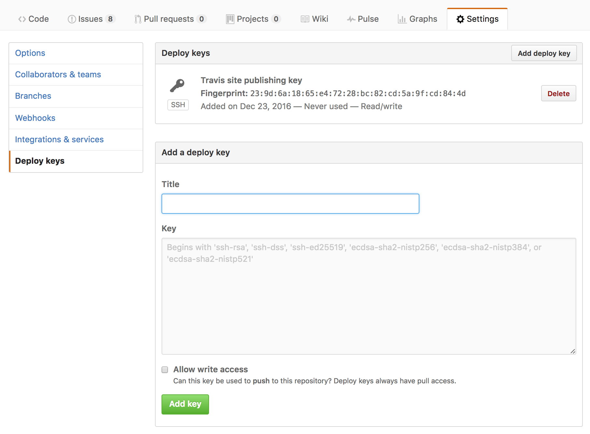

# Publishing

The following sections show you how to configure publishing of your site. To
publish a generated site to [GitHub Pages] you can use the [sbt-ghpages] plugin.
For sites hosted on S3 one option is to use [sbt-s3]. We expect other publishing
mechanisms to be supported in the future.

## Publishing to GitHub Pages using sbt-ghpages

Set up the plugin by adding the following to `project/plugins.sbt` (check the
[sbt-ghpages project][sbt-ghpages] for the most recent version).

@@ snip[sbt-ghpages](../../../project/plugins.sbt) { #sbt-ghpages }

Then configure your sbt build to use a special remote when running on Travis CI
and otherwise fall back to the normal Git remote configured via the `scmInfo`
setting.

@@ snip[ghpages-publish](../../../build.sbt) { #scm-info #ghpages-publish }

At this point you should be able to run `sbt ghpagesPushSite` to publish your
site.

@@@ note

Before running `sbt ghpagesPushSite` the first time you need to create the
`gh-pages` branch. One way to do it is to build your site and publish a first
version of it using the following commands:

```sh
$ sbt clean make-site                             # <1> Build the site
$ origin=$(git remote get-url origin)             # <2> Save the current remote for later
$ cd target/site
$ git init                                        # <3> Create site repo and add initial content
$ git add .
$ git commit -m "Initial import of GitHub Pages"
$ git push --force "$origin" master:gh-pages      # <4> Publish the repo's master branch as gh-pages
```

@@@

## Publishing to GitHub Pages from Travis CI

The following section walks you through the steps to configure Travis CI to
publish your site as part of the [deployment process][travis-deployment]. It
assumes that you have already configured your sbt project to publish your site
using the sbt-ghpages plugin as described in the previous section.

@@@ warning { title='Security Considerations' }

The authentication mechanism that enables Travis CI to update the `gh-pages`
branch requires that write access to your GitHub project is granted to an SSH
key pair that you control. An encrypted version of the secret key must be added
to the Git repository in order for Travis CI to decrypt it and make it available
for pushing to your Git repository. This means that anyone with the ability to
modify the Travis CI or sbt build configuration will be able to get hold of the
secret key and gain write access to your GitHub repository. For this reason it
is recommented to disable publishing for pull requests.

The instructions are based on [this gist][auto-deploy-gist] and you are encouraged
to consult the reasons for choosing this authentication mechanism.

@@@

To authenticate Travis CI to publish changes to the `gh-pages` branch you need
to first generate an SSH key pair:

```sh
$ ssh-keygen -t rsa -b 4096 -C "sbt-site@travis" -f project/travis-deploy-key
```

Add the public key found in `project/travis-deploy-key.pub` as a deploy key in
the **Deploy Keys** section of your GitHub project's settings page at
<https://github.com/[org]/[repo]/settings/keys>. Make sure you allow write
access for the deploy key by clicking the check box.



Prepare the secret key for inclusion in the repository by opening a terminal and
encrypting the secret key file using the Travis CLI:

```text
$ gem install travis
$ travis encrypt-file project/travis-deploy-key project/travis-deploy-key.enc
encrypting project/travis-deploy-key for [org]/[repo]
storing result as project/travis-deploy-key.enc
storing secure env variables for decryption

Please add the following to your build script (before_install stage in your .travis.yml, for instance):

    openssl aes-256-cbc -K $encrypted_3afbfedfa397_key -iv $encrypted_3afbfedfa397_iv -in project/travis-deploy-key.enc -out project/travis-deploy-key -d

Pro Tip: You can add it automatically by running with --add.

Make sure to add project/travis-deploy-key.enc to the git repository.
Make sure not to add project/travis-deploy-key to the git repository.
Commit all changes to your .travis.yml.
```

As instructed in the output of the command add the encrypted secret key found in
`project/travis-deploy-key.enc` to the repository and delete or ignore the
unencrypted secret key file.

```
$ git add project/travis-deploy-key.enc
$ echo project/travis-deploy-key >> .git/info/exclude
```

Finally, configure a deploy step in `.travis.yml` using the script provider. For
a complete set of options and triggers see the [Travis deployment
documentation][travis-deployment]. In this example, we publishing when a tag is
created and explicitly disable publishing for pull request. The `before_deploy`
step takes care of setting up the environment so that `git push` automatically
finds the deploy key.

@@ snip[travis-deploy](../../../.travis.yml) { #travis-deploy }

@@@ note

Ensure that you modify the above example to use the instructions on how to
decrypt the deploy key provided in the output of the `travis encrypt-file`
command.

At this point, it would also be a good idea to run `travis lint` to check that
the resulting `.travis.yml` is correct.

@@@

[sbt-s3]: https://github.com/sbt/sbt-s3
[sbt-ghpages]: http://github.com/sbt/sbt-ghpages
[GitHub Pages]: https://pages.github.com
[travis-deployment]: https://docs.travis-ci.com/user/deployment
[auto-deploy-gist]: https://gist.github.com/domenic/ec8b0fc8ab45f39403dd
